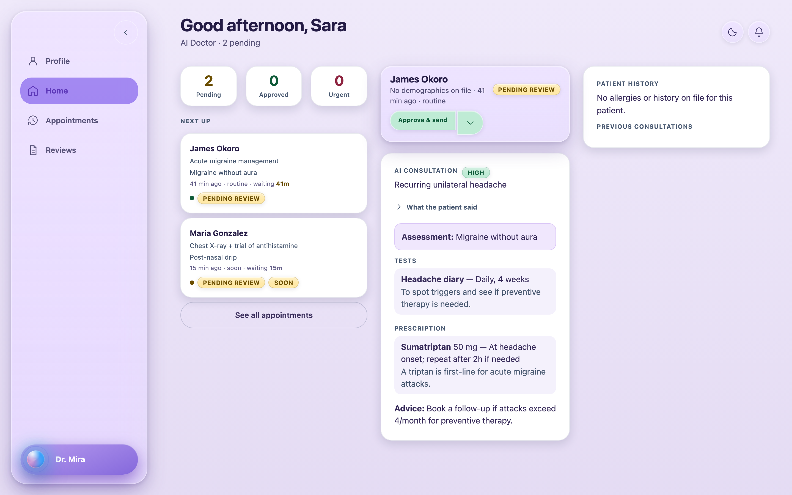

# AI-Doctor

A demo clinic web app where an AI drafts a clinical plan from a patient conversation and a licensed doctor must approve it in Postgres before it can become a prescription.

The approval gate is a database constraint, not application logic — the AI path has no INSERT grant on `prescriptions` at all.

[Live demo](https://ai-doctor-8ai.pages.dev) — [Docs](docs/)



## Requirements

- [Bun](https://bun.sh) 1.x — the only package manager the scripts use
- Docker — the local Supabase stack runs in it
- [Supabase CLI](https://supabase.com/docs/guides/cli) — Postgres, Auth, Storage, Realtime, Edge Runtime
- A Gemini API key with quota, if you want the AI consult to answer. Without one the UI runs and the review queue works; the consult replies with an error.

## Run it

```bash
git clone https://github.com/nvkudva/AI-Doctor.git
cd AI-Doctor
bun install
cp apps/web/.env.example apps/web/.env.local   # fill in the variables below
bun run db:start                               # prints the API URL and anon key
bun run db:reset                               # applies migrations, then seed.sql
bun run dev                                    # http://localhost:3001
```

The login page should offer "Fake patient" and "Fake doctor" buttons that sign in as seeded users under real RLS.

With `VITE_SUPABASE_URL` and `VITE_SUPABASE_ANON_KEY` both unset, the app runs entirely on seeds and `localStorage` — no Docker, no backend.

## Configuration

`apps/web/.env.local` (browser — never put a provider or service-role key here):

| Variable | Required | What it is |
|---|---|---|
| `VITE_SUPABASE_URL` | No | Local or hosted API URL. Unset means offline demo mode. |
| `VITE_SUPABASE_ANON_KEY` | No | Anon key printed by `bun run db:start`. Public by design; RLS enforces access. |
| `VITE_TENANT_SLUG` | Yes | Tenant to act as when the hostname has no subdomain. `citycare` in the seed. |
| `VITE_DEMO_PASSWORD` | No | Shared password for the seeded accounts. Set it to enable the fake-login buttons. |

`supabase/functions/.env` (server, loaded by `bun run db:functions`):

| Variable | Required | What it is |
|---|---|---|
| `GEMINI_API_KEY` | For real AI | Without it the consult and review functions fail. |
| `AI_PROVIDER` | No | Defaults to `stub`; set to the Gemini provider for real model calls. |
| `GEMINI_TEXT_MODEL`, `GEMINI_LIVE_MODEL`, `GEMINI_LIVE_VOICE` | No | Model overrides. |

## How it works

`apps/web/` is a React 19 + Vite 7 PWA with `modules/patient`, `modules/doctor` and `modules/login`. Two interchangeable stores implement the same interface — `store/LocalClinic.tsx` (seeds plus `localStorage`) and `store/SupabaseClinic.tsx` (live) — and `store/ClinicProvider.tsx` picks one based on whether Supabase is configured.

`supabase/functions/` holds three Deno Edge Functions: `ai-consult` runs a patient turn, `ai-review` drives the doctor-side coordinator, and `voice-token` mints a short-lived Gemini Live token. `_shared/agent.ts` rebuilds consult state from Postgres on every turn and runs a deterministic red-flag sweep before any model call.

`supabase/migrations/` is forward-only and carries the authorization layer: `prescriptions.review_id` is `NOT NULL UNIQUE`, a trigger re-checks that the approving review matches the consult, the doctor and the draft hash, and INSERT on `prescriptions` is revoked from `anon`, `authenticated` and `service_role`. Consult state moves through an allowlist table. Tenant isolation is RLS.

## Status

Working: the approval gate, the consult state machine, RLS tenant isolation, the doctor review queue, labs and appointments, and the offline demo store.

Not working or not built:

- The voice leg is not wired up. `voice-token` mints a Live session token, but no client code opens the WebSocket, and no Live tool call is dispatched. The consult today is text.
- The hosted demo has no funded Gemini quota, so the AI consult returns an error there. Everything around it is live against Postgres.
- The hosted demo is a single shared database with open signup and no password on the seeded accounts. There is no reset schedule. Assume anything you write is public and anything you read may have been written by a stranger.
- The pgTAP suites (`supabase/tests/`, covering the gate, transitions and RLS) have never been run against a live database — see `supabase/README.md`. There are no tests for `apps/` or for the Edge Functions.
- `apps/web/src/lib/api/ai.ts` contains a second, unguarded clinical path used in offline demo mode. It hard-codes drug names and doses and none of the server-side guards apply to it. Do not treat its output as clinical content.
- A code review on 2026-09-07 recorded open P0 authorization defects in `voice-token` and `ai-review`. See [REVIEW.md](REVIEW.md) before deploying this anywhere real.

Not a medical device. Demo data throughout; no real patient data, no clinical claims.

## License

No licence file yet — all rights reserved.
