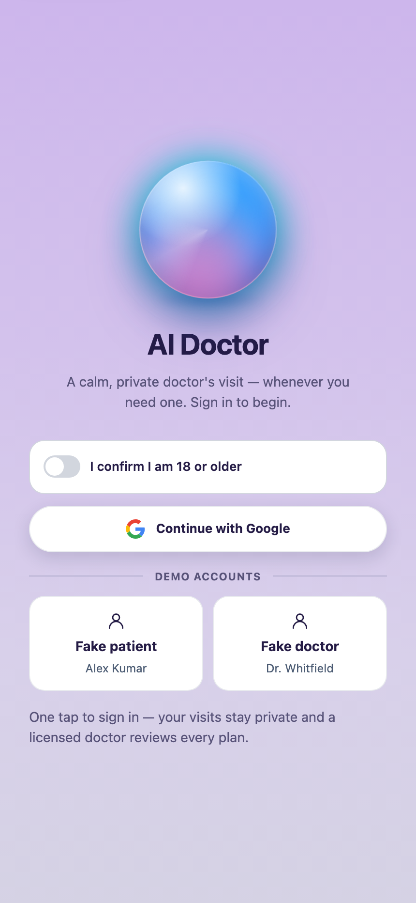
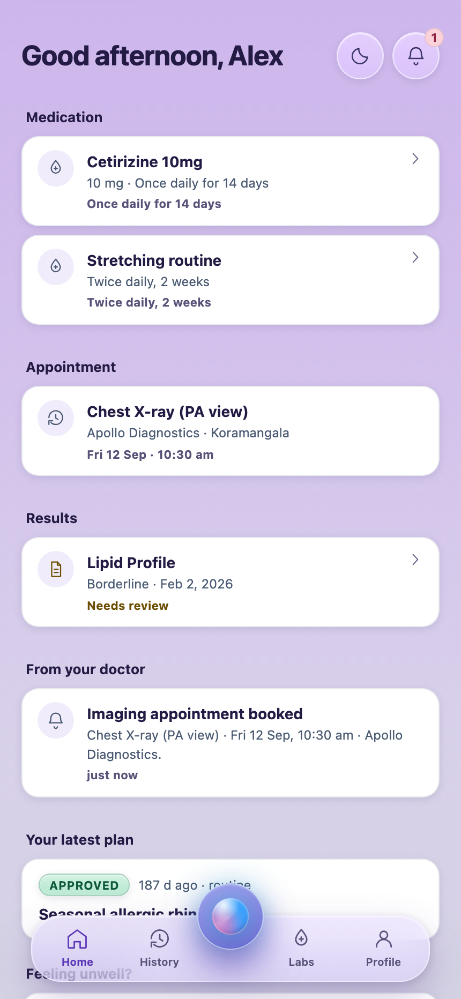
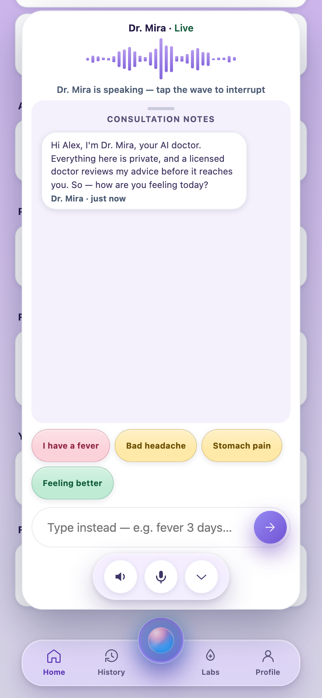
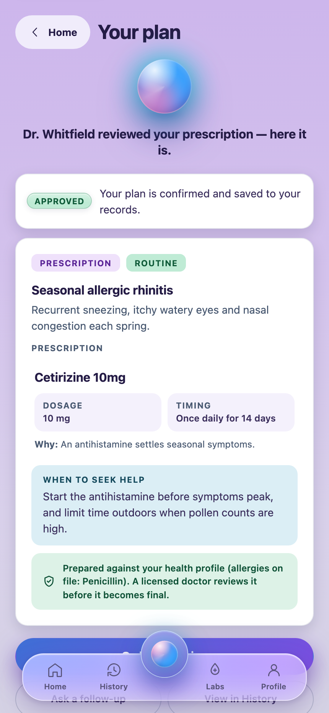

# AI Doctor

A voice-first AI consultation that a licensed doctor signs off before it reaches the patient.

Dr. Mira — the AI physician — talks the patient through their symptoms, then drafts a plan. That draft is not a prescription. It sits in a review queue until a real doctor approves it, and the database is built so the AI *cannot* publish one on its own.

**[Try the demo →](https://ai-doctor-8ai.pages.dev)** — sign in as **Alex Kumar** (patient) or **Dr. Whitfield** (doctor); no password. Seeded data, shared by everyone who opens the link. The consultation itself needs a Gemini key with quota, so Dr. Mira will say she is having trouble; everything else — the review queue, the approval gate, labs, appointments — is live against a real Postgres with RLS.

<p align="center">
  
  
  
  
</p>

## The approval gate

Human-in-the-loop is structural, not procedural. `prescriptions` is writable only through the doctor-approval path — enforced by a Postgres constraint and trigger, not by application code. Tenant isolation is RLS. There is no permission logic in the app that a bug could bypass.


The doctor's desk: pending drafts on the left, the AI's reasoning and proposed plan in the middle, patient history on the right. Approve, edit, or decline — every outcome is traced.

## Stack

| | |
|---|---|
| Frontend | React 19, React Router 8, Vite 7, PWA — one app, `/patient` and `/doctor` modules |
| Backend | Supabase — Postgres + RLS, Auth, Realtime, Storage |
| Server logic | Deno Edge Functions: `ai-consult`, `ai-review`, `voice-token` |
| AI | Gemini — Live API for the speech-to-speech leg, text + structured JSON for the clinical draft |

Voice audio streams directly between the browser and Google, authorized by a short-lived token minted server-side. No model or provider key ever reaches the browser.

## Layout

```
apps/web/          the PWA — shell, modules/{patient,doctor,login}, lib/{ui,api,core,theme,voice}
supabase/          migrations/ (forward-only, each ships its own RLS)
                   functions/  (Deno Edge Functions + _shared/ protocols, guards, tools)
                   tests/      (pgTAP), seed.sql
docs/              PRD, ARCHITECTURE, DATA-MODEL, DESIGN — the sources of truth
```

## Run it

Requires [Bun](https://bun.sh), Docker, and the [Supabase CLI](https://supabase.com/docs/guides/cli).

```bash
bun install
bun run db:start          # boots Postgres, Auth, Storage, Realtime, Edge Runtime
bun run db:reset          # applies migrations, then seed.sql
bun run dev               # http://localhost:3001
```

Copy `apps/web/.env.example` to `apps/web/.env.local` and paste the API URL and anon key that `db:start` printed. Set `VITE_DEMO_PASSWORD=1234` and the login page's **Fake patient** / **Fake doctor** buttons sign in as real seeded users under real RLS.

With both Supabase variables unset the app runs in demo mode instead — seeds and `localStorage`, no network, no backend needed.

```bash
bun run typecheck
bun run db:test           # pgTAP: approval gate, state transitions, RLS isolation
```

## Docs

| | |
|---|---|
| [`docs/PRD.md`](docs/PRD.md) | what to build |
| [`docs/ARCHITECTURE.md`](docs/ARCHITECTURE.md) | how to build it — governs all implementation |
| [`docs/DATA-MODEL.md`](docs/DATA-MODEL.md) | persistence, the state machine, the gate |
| [`docs/DESIGN.md`](docs/DESIGN.md) | design system |
| [`supabase/README.md`](supabase/README.md) | backend |

---

Not a medical device. Demo data throughout; no real patient data, no clinical claims.
