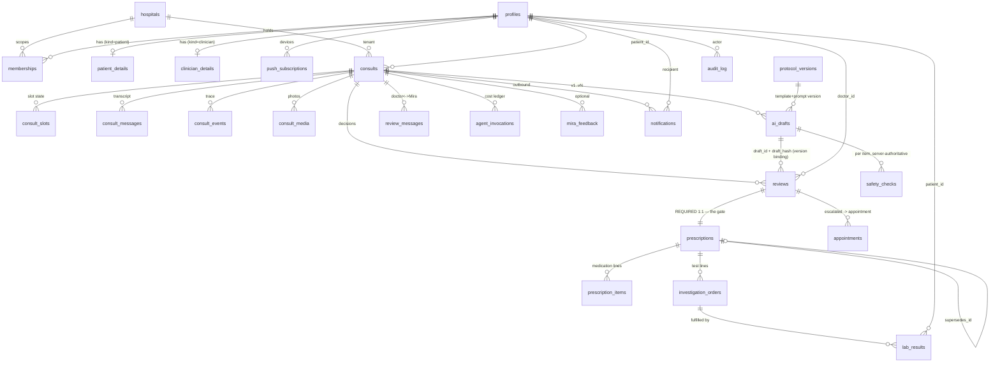

# AI Doctor — Data Model (Source of Truth for Persistence)

**Status:** Design. This document governs *what the data is*. `docs/PRD.md` governs *what to build*,
`docs/ARCHITECTURE.md` governs *how the system is shaped*, `docs/AGENT-EXPERIENCE.md` governs *how Mira
behaves*. Where this document contradicts the sketches in PRD §6.4 or ARCHITECTURE §7.2, the divergence is
called out explicitly and justified; nothing here is a silent override.

**Ground rules used throughout:**

- Every claim about current behaviour cites `file:line` in code that was read.
- Where a design choice is not settled by the three governing docs, it is deferred to §7 "Assumptions to
  confirm" rather than decided quietly.
- The human-in-the-loop gate (`AGENT-EXPERIENCE.md` §5.4) is a *schema* property here, not a convention.
  If any part of this model would let an approved prescription exist without a doctor's review row, that
  part is wrong.

---

## 0. Scope and inputs

Read before writing this: `docs/PRD.md` (§3A.4 lifecycle, §3A.5 edge cases, §5.4 trace, §6.4 schema
sketch), `docs/ARCHITECTURE.md` (§4.3 turn path, §4.4 review flow, §4.6 timers, §7 database design),
`docs/AGENT-EXPERIENCE.md` (§3.2 slot set, §4.3 tools, §4.4 state locations, §5.4 the gate), and the
current in-memory shapes: `apps/web/src/lib/core/index.ts`, `apps/web/src/store/types.ts`,
`apps/web/src/store/seeds.ts`, `apps/web/src/store/ClinicProvider.tsx`, `apps/web/src/lib/api/storage.ts`,
`apps/web/src/shell/auth.tsx`.

**There is no database today.** `supabase/` does not exist in the repo (ARCHITECTURE §3 marks it
"(planned)"). `@supabase/supabase-js` is a dependency (`apps/web/package.json:13`) and is used for exactly
one thing: OAuth session retrieval in `apps/web/src/shell/auth.tsx:88-119`. Every domain record in the
product is either a module-level constant (`apps/web/src/store/seeds.ts`) or React state persisted to one
localStorage key (`apps/web/src/lib/api/storage.ts:6`).

**Model count: 25 tables + 1 view + 6 storage buckets.**

---

## 1. Entities and relationships

### 1.1 Entity catalogue

| # | Entity | Purpose | Append-only? | Notes |
|---|---|---|---|---|
| 1 | `hospitals` | Tenant. Branding, AI config, SLA thresholds. | no | PRD T-1/T-3 |
| 2 | `profiles` | One row per `auth.users` row. Name, global kind. | no | |
| 3 | `memberships` | Which profile has which role at which hospital. **The tenancy join.** | no | PRD T-4 |
| 4 | `patient_details` | Clinical profile: DOB, sex, blood group, allergies, conditions, meds. | no | PRD P-2 |
| 5 | `clinician_details` | Registration no., specialty, languages, review preferences. | no | Today: `seeds.ts:85-93` |
| 6 | `consults` | The case. Status, urgency, chief complaint, working dx. | no (status machine) | PRD §3A.4 |
| 7 | `consult_slots` | One row per clinical slot with evidence span and confidence. | no (upsert) | AGENT-EXP §3.2 |
| 8 | `consult_messages` | Every patient/Mira turn, voice or text. | **yes** | |
| 9 | `consult_events` | Transitions and system actions that are not messages. | **yes** | PRD §5.4 |
| 10 | `consult_media` | Patient-shared photos/video; storage pointer + AI findings. | **yes** | MVP-1 |
| 11 | `ai_drafts` | Versioned AI recommendation. The thing a doctor signs. | **yes** (versions) | |
| 12 | `safety_checks` | Server-authoritative `check_drug_safety` results per draft item. | **yes** | AGENT-EXP §4.3 |
| 13 | `agent_invocations` | Model call ledger: agent, model, tokens, audio seconds, cost. | **yes** | PRD A-5 |
| 14 | `protocol_versions` | Registry of complaint templates + prompt versions in effect. | **yes** | AGENT-EXP §3.3 |
| 15 | `review_messages` | Doctor ↔ Mira coordinator conversation, with citations. | **yes** | PRD D-8 |
| 16 | `reviews` | The doctor's decision. **The gate row.** | **yes** | PRD D-4 |
| 17 | `mira_feedback` | Doctor's feedback on Mira, for the operator. | **yes** | PRD §3A.3 |
| 18 | `prescriptions` | The approved, immutable clinical artefact. | **yes** (supersede) | PRD D-5 |
| 19 | `prescription_items` | Medication lines of an approved prescription. | **yes** | |
| 20 | `investigation_orders` | Test/imaging lines of an approved plan, with own lifecycle. | no (status) | |
| 21 | `lab_results` | A result, structured: value, unit, ref range, abnormal flag. | no | Today: `seeds.ts:79-82` |
| 22 | `appointments` | Doctor-requested real appointment (PRD §3A.3 item 4). | no | |
| 23 | `notifications` | Outbound patient/doctor notices, with read state. | no (read flag) | Today: `types.ts:25-27` |
| 24 | `push_subscriptions` | Web Push endpoints per device. | no | PRD UC-2.7 |
| 25 | `audit_log` | Non-consult privileged actions: sign-in, storage access, admin. | **yes** | |
| — | `consult_trace` (view) | Time-ordered UNION of 8–16, 18, 10. | n/a | PRD O-1 |

### 1.2 Relationship diagram



The one relationship that carries the product's entire safety claim:

```
ai_drafts ──(draft_id + draft_hash)──▶ reviews ──(review_id NOT NULL UNIQUE)──▶ prescriptions
                                          ▲
                                   doctor_id = auth.uid()
```

`prescriptions.review_id` is `NOT NULL UNIQUE` and the only insert path is a `SECURITY DEFINER` function.
The service role that the AI path runs as has **no** insert grant on `prescriptions`. See §3.4.

### 1.3 Where today's shapes are wrong or too thin

Every row below is a defect in the current model, not a missing feature.

**`CaseItem` is ten entities in one blob.** `apps/web/src/lib/core/index.ts:23-33` mixes: the consult
(`id`, `status`, `submittedAt`), the patient (`patient`, `demo`, `history`), the AI draft (`rec`,
`confidence`, `flags`, `stated`, `inferred`, `observation`), the review outcome (`reviewedBy`,
`reviewedAt`, `decision`, `rejectReason`), the edit trail (`editedBy`, `editedAt`), and *copies* of the
patient's labs and prior consults (`relevantLabs`, `pastLabs`, `pastConsults`). Nothing can be queried,
versioned, or audited independently.

| Defect | Citation | Why it breaks |
|---|---|---|
| Patient is a display string, not a key | `lib/core/index.ts:25` — `patient: string; demo: string` (`'34 · Male · O+'`) | Cannot join a consult to a record, cannot enforce RLS, cannot compute age |
| No `hospital_id` on anything | entire `store/` — only tenancy code is `lib/core/index.ts:57` `resolveTenantSlug`, used for the display name at `shell/App.tsx:34` | PRD T-2 (RLS tenancy) has no anchor to attach to |
| Two status vocabularies | `lib/core/index.ts:5-7` `ConsultStatus` union vs `store/types.ts:11` `UserConsult.status: string` holding `'Completed'` / `'Approved'` (`seeds.ts:57`, `ClinicProvider.tsx:82`) | The patient's record list and the doctor's queue disagree about what a status is |
| Status set is incomplete and duplicated | `lib/core/index.ts:5-7` has both `pending` and `pending_review` (both treated as reviewable, `:38`); missing `escalated`, `communicated`, `closed`, `superseded`, `needs_human` (PRD §3A.4, AGENT-EXP §5.6) | The lifecycle the PRD specifies is not representable |
| **A prescription can be created with no review row** | `store/ClinicProvider.tsx:66-84` — `decide()` mutates the case and pushes a `UserRx`; no review record is created anywhere in the codebase | The human-in-the-loop gate exists only as UI convention |
| **A model token approves a prescription** | `modules/doctor/useReview.ts:124-127` — `if (data.action === 'approve') onApproveRef.current()` | Exactly what AGENT-EXP §5.4 says must become structurally impossible |
| Reviewer identity is a hardcoded string | `store/ClinicProvider.tsx:70` — `reviewedBy: 'Dr. Whitfield'` | No doctor id, no attribution, no diff, nothing signable |
| Approval drops all but the first item | `store/ClinicProvider.tsx:79-81` — `rec.items[0]` only | A two-drug prescription becomes a one-drug prescription silently |
| Prescription has no identity or lineage | `store/types.ts:15-19` — `UserRx { name, detail, date, user?, nextDose? }`; no `id`, no `consult_id`, no `doctor_id`, no `supersedes_id`, `date: 'Today'` (`ClinicProvider.tsx:80`) | PRD D-5 (immutable + superseding version) is unimplementable |
| Drafts are not versioned | `store/types.ts:41` `updateRec` overwrites `CaseItem.rec` in place (`ClinicProvider.tsx:86-90`) | Version binding (AGENT-EXP §5.4 Layer 4) has nothing to bind to |
| Safety flags are a constant, not a check | `lib/api/mira.ts:147` instructs the model to emit `'Penicillin allergy respected'`; `lib/api/ai.ts:146` hardcodes `flags: ['Penicillin allergy respected']`; `modules/patient/components/PatientFlow.tsx:65` falls back to the same literal | An unverified attestation is shown to a doctor about to sign |
| Slots live in a browser ref | `modules/patient/useConsult.ts:203-205` — `messagesRef`, `slotsRef`, `notesRef` | Refresh loses the consult; multi-device impossible; trace incomplete (AGENT-EXP §4.4) |
| Slots have no evidence, status, or attempt count | `lib/api/mira.ts:8-17` — `SymptomSlots` is 8 optional strings | AGENT-EXP §3.2 requires `status`, `confidence`, `source`, `evidence`, `attempts`; no red-flag screen slot exists at all |
| Labs are one global constant shared by all patients | `store/seeds.ts:79-82`; copied into both `relevantLabs` and `pastLabs` of every new case at `modules/patient/components/PatientFlow.tsx:70-71` | Every patient has the same labs |
| Lab shape has no value, unit, or range | `lib/core/index.ts:20` — `{ name, date: string, result: string, ok: boolean }` | Cannot trend, cannot flag, cannot compare to reference range (PRD §3B.1 Lab Technician Agent) |
| Appointments are display strings | `store/types.ts:21-23` — `when: string` (`'Fri 12 Sep · 10:30 am'`), `where: string` (`seeds.ts:76`) | No timestamp, no patient FK, no doctor FK, no status |
| Notices have no id; dismissal is by array index | `store/types.ts:25-27`; `ClinicProvider.tsx:94` — `filter((_, i) => i !== index)` | Two clients disagree about which notice was dismissed; no read state; no recipient |
| The audit log is declared and never written | `lib/core/index.ts:35` `AuditEvent` and `lib/api/storage.ts:48` `recordEvent` have **zero call sites** (grep across `apps/web/src`); `LocalSnapshot.events` (`storage.ts:12`) is never populated — the three persist effects at `ClinicProvider.tsx:39-47` write `liveQueue`, `consultsAdd`, `rxAdd` only | PRD §5.4 "if it isn't in the trace, it didn't happen" currently means nothing is in the trace |
| Role is client-trusted | `shell/auth.tsx:53` — `meta.role === 'doctor' ? 'doctor' : 'patient'` read from `user_metadata`, which the user can write | A patient can claim the doctor role |
| Patient identity is baked into the prompt | `lib/api/mira.ts:87` — `Patient on file: Alex Kumar, 34, male … allergic to Penicillin` | One patient exists; A-3 server-side safety injection has no per-patient source |
| Persistence is one untyped key | `lib/api/storage.ts:6-13` — `vd_state_v1`, fields typed `any[]` | No schema, no migration, no isolation between patient and doctor data |
| Patient-created cases and the doctor queue are the same array | `ClinicProvider.tsx:23-24` — `[...saved.liveQueue, ...seedQueue]` | Patient writes and clinician reads share one mutable list with no boundary |

---

## 2. Canonical JSON

These are the contract. Field comments give the wire type and nullability; `?` in the comment means the
key may be `null` (it is always *present*). Timestamps are RFC 3339 UTC strings. All ids are UUID v4
strings. Enum values are exhaustive as written.

### 2.1 `hospitals`

```jsonc
{
  "id": "0e2c…",                          // uuid, not null
  "slug": "citycare",                     // text, not null, unique, lowercase [a-z0-9-]
  "name": "CityCare Hospital",            // text, not null
  "logo_url": "https://…/logo.svg",       // text?, null until branding uploaded
  "theme": {                              // jsonb, not null, default {}
    "accent": "#0F6E5C",
    "surface_mode": "auto"                // "auto"|"light"|"dark"
  },
  "ai_config": {                          // jsonb, not null, default {}
    "model": "claude-opus-5",             // text?, per-hospital override
    "voice_persona_id": "mira-warm-in",   // text?
    "quotas": { "daily_consults": 200, "session_minutes_per_consult": 12, "max_patient_turns": 12 },
    "sla": { "warn_minutes": 120, "expire_hours": 24, "abandon_minutes": 30,
             "clinic_hours": { "tz": "Asia/Kolkata", "open": "09:00", "close": "20:00" } }
  },
  "admin_contact_email": "ops@citycare.in", // text?, target of sla_escalated
  "created_at": "2026-09-01T04:00:00Z",   // timestamptz, not null
  "active": true                          // boolean, not null, default true
}
```

### 2.2 `profiles`

```jsonc
{
  "id": "c1a9…",                          // uuid, not null, = auth.users.id
  "full_name": "Alex Kumar",              // text, not null
  "email": "alex.kumar@gmail.com",        // text, not null (citext)
  "kind": "patient",                      // enum profile_kind: "patient"|"clinician"|"operator"
  "avatar_path": "c1a9…/2026/a1.jpg",     // text?, key in the `avatars` bucket, NOT a URL
  "locale": "en-IN",                      // text, not null, default 'en-IN'
  "created_at": "2026-09-01T05:12:00Z",   // timestamptz, not null
  "last_seen_at": "2026-09-06T09:40:00Z"  // timestamptz?
}
```

`kind` is the *global* nature of the account. The **operative role is `memberships.role`**, never
`user_metadata` (which `shell/auth.tsx:53` trusts today and must stop trusting).

### 2.3 `memberships`

```jsonc
{
  "id": "9a41…",                          // uuid, not null
  "profile_id": "c1a9…",                  // uuid, not null → profiles.id
  "hospital_id": "0e2c…",                 // uuid, not null → hospitals.id
  "role": "patient",                      // enum member_role: "patient"|"doctor"|"admin"
  "status": "active",                     // enum member_status: "active"|"suspended"
  "created_at": "2026-09-01T05:12:00Z"    // timestamptz, not null
}
```

`UNIQUE (profile_id, hospital_id)`. PRD T-4: a patient of two hospitals has two rows and the data never
crosses.

### 2.4 `patient_details`

```jsonc
{
  "profile_id": "c1a9…",                  // uuid, not null, PRIMARY KEY
  "dob": "1992-03-14",                    // date, not null (18+ enforced, PRD §3A.5)
  "sex": "male",                          // enum sex_at_birth: "male"|"female"|"other"|"undisclosed"
  "blood_group": "O+",                    // text?, one of the 8 ABO/Rh values
  "allergies": [                          // jsonb array, not null, default []
    { "substance": "Penicillin", "class": "beta_lactam", "severity": "severe",
      "reaction": "rash, swelling", "source": "self_reported",   // "self_reported"|"clinician_confirmed"
      "recorded_at": "2026-09-01T05:14:00Z" }
  ],
  "conditions": [                         // jsonb array, not null, default []
    { "name": "Asthma", "since": "2015", "status": "active", "source": "self_reported" }
  ],
  "medications": [                        // jsonb array, not null, default []
    { "name": "Salbutamol inhaler", "dose": "100 mcg", "frequency": "PRN", "source": "self_reported" }
  ],
  "self_attested": true,                  // boolean, not null — PRD §3A.5 identity note
  "updated_at": "2026-09-04T11:00:00Z"    // timestamptz, not null
}
```

`allergies[].class` is the field the deterministic allergy check reads (AGENT-EXP §5.2). It is **not**
model-derived — see §7 assumption 3.

### 2.5 `clinician_details`

```jsonc
{
  "profile_id": "77b3…",                  // uuid, not null, PRIMARY KEY
  "registration_no": "GMC-483920",        // text, not null
  "registration_authority": "KMC",        // text, not null
  "specialty": "General Physician",       // text, not null
  "languages": ["en", "hi", "kn"],        // text[], not null, default '{}'
  "years_experience": 12,                 // int?
  "signature_path": "77b3…/sig.png",      // text?, key in `avatars` bucket (private)
  "prefs": {                              // jsonb, not null, default {}
    "mira_presentation_enabled": true,    // PRD D-7 persisted preference
    "queue_sort": "urgency"
  },
  "updated_at": "2026-09-02T08:00:00Z"    // timestamptz, not null
}
```

Replaces the display-only constant at `store/seeds.ts:85-93`. `patients`/`rating` from that constant are
derived metrics, not stored columns.

### 2.6 `consults`

```jsonc
{
  "id": "4f80…",                          // uuid, not null
  "hospital_id": "0e2c…",                 // uuid, not null
  "patient_id": "c1a9…",                  // uuid, not null → profiles.id
  "status": "pending_review",             // enum consult_status (see §3.2)
  "chief_complaint": "Dry cough, 2 weeks",// text?, null until presenting_complaint slot binds
  "urgency": "soon",                      // enum urgency: "routine"|"soon"|"urgent"; not null, default 'routine'
  "channel_mix": { "voice_turns": 6, "text_turns": 1 }, // jsonb, not null, default {}
  "working_dx": [                         // jsonb array, not null, default [] — AGENT-EXP §4.4
    { "label": "Post-nasal drip", "likelihood": 0.55, "updated_at": "2026-09-06T09:31:00Z" }
  ],
  "protocol_version_id": "b7d0…",         // uuid?, → protocol_versions.id, set when template loads
  "assigned_doctor_id": null,             // uuid?, set on first doctor_opened; null = unclaimed queue
  "sla_warned_at": null,                  // timestamptz?, set by the 2h timer
  "created_at": "2026-09-06T09:24:00Z",   // timestamptz, not null
  "submitted_at": "2026-09-06T09:38:00Z", // timestamptz?, set on → pending_review
  "decided_at": null,                     // timestamptz?, set on → approved|rejected|escalated
  "closed_at": null,                      // timestamptz?
  "last_patient_turn_at": "2026-09-06T09:37:12Z" // timestamptz?, drives abandonment timer
}
```

`ai_confidence` and `ai_flags` from PRD §6.4 are **not** on this table. They belong to a specific draft
version and live on `ai_drafts` — putting them here would make them unversionable and would recreate the
`CaseItem` blob (`lib/core/index.ts:27`). This is a deliberate divergence from PRD §6.4.

### 2.7 `consult_slots`

```jsonc
{
  "id": "aa10…",                          // uuid, not null
  "consult_id": "4f80…",                  // uuid, not null
  "slot_id": "duration_course",           // enum slot_id — the AGENT-EXP §3.2 set, not free text
  "status": "filled",                     // enum slot_status: "unknown"|"asked"|"filled"|"refused"
                                          //   |"not_applicable"|"unanswered"
  "value": "About two weeks, constant, slowly worsening", // text?, null unless status='filled'
  "confidence": 0.86,                     // numeric(3,2)?, 0..1, null unless filled
  "source": "patient",                    // enum slot_source: "patient"|"record"|"inferred"
  "evidence_message_id": "77e0…",         // uuid?, → consult_messages.id
  "evidence_span": [12, 47],              // int[2]?, char offsets into that message's content
  "attempts": 1,                          // int, not null, default 0, CHECK attempts <= 2
  "updated_at": "2026-09-06T09:31:00Z"    // timestamptz, not null
}
```

**Divergence from AGENT-EXPERIENCE §4.4**, which puts slots in `consults.slots` JSONB. A table is used
instead because (a) the conclude gate must be a *queryable* assertion — "no required slot is `unknown`"
is one `NOT EXISTS` against a table and an unwritable check against a JSON blob; (b) `evidence_message_id`
is a real FK that must not dangle; (c) each slot's fill is a trace event with its own timestamp, and
JSONB overwrite loses that. `UNIQUE (consult_id, slot_id)`. See §7 assumption 1.

### 2.8 `consult_messages`

```jsonc
{
  "id": "77e0…",                          // uuid, not null
  "consult_id": "4f80…",                  // uuid, not null
  "hospital_id": "0e2c…",                 // uuid, not null (denormalized for RLS + index)
  "seq": 7,                               // bigint, not null — monotonic per consult, gapless ordering
  "sender": "patient",                    // enum message_sender: "patient"|"ai"|"system"
  "agent_id": null,                       // text?, e.g. "doctor_agent" when sender='ai' (PRD §3B.3)
  "channel": "voice",                     // enum message_channel: "voice"|"text"
  "content": "It's been about two weeks now, and it's getting worse at night.", // text, not null
  "is_interim": false,                    // boolean, not null, default false — interim STT never persisted as final
  "audio_path": null,                     // text?, key in `consult-audio` bucket; null when retention is off
  "audio_ms": 4120,                       // int?, duration for cost accounting
  "created_at": "2026-09-06T09:31:02Z"    // timestamptz, not null
}
```

Append-only: no UPDATE or DELETE grant to anyone including the service role. Voice and text turns are the
same row shape — this is what makes PRD P-3a (mixed channels in one conversation) free.

### 2.9 `consult_events`

```jsonc
{
  "id": "9c22…",                          // uuid, not null
  "consult_id": "4f80…",                  // uuid, not null
  "hospital_id": "0e2c…",                 // uuid, not null
  "event_type": "status_change",          // enum consult_event_type: "status_change"|"queued"
                                          //   |"doctor_opened"|"notification_sent"|"sla_escalated"
                                          //   |"expired"|"abandoned"|"slot_filled"|"red_flag_raised"
                                          //   |"safety_check"|"draft_created"|"draft_revised"
                                          //   |"media_uploaded"|"tool_call"|"refusal"|"system"
  "actor": "system",                      // enum actor_kind: "patient"|"ai"|"doctor"|"system"
  "actor_id": null,                       // uuid?, → profiles.id; null when actor='system'|'ai'
  "payload": { "from": "active", "to": "pending_review", "reason": "sufficiency" }, // jsonb, not null
  "created_at": "2026-09-06T09:38:00Z"    // timestamptz, not null
}
```

Written by triggers and `SECURITY DEFINER` functions only. `status_change` rows are written by the state
machine trigger itself (§3.2), so no code path can change a consult's status without leaving a trace row.

### 2.10 `consult_media`

```jsonc
{
  "id": "5d31…",                          // uuid, not null
  "consult_id": "4f80…",                  // uuid, not null
  "hospital_id": "0e2c…",                 // uuid, not null
  "uploaded_by": "c1a9…",                 // uuid, not null → profiles.id
  "kind": "image",                        // enum media_kind: "image"|"video"
  "storage_path": "0e2c…/4f80…/5d31….jpg",// text, not null, unique — key in `consult-media`
  "mime_type": "image/jpeg",              // text, not null, CHECK in allowlist (§5)
  "bytes": 842113,                        // bigint, not null, CHECK <= 10485760
  "sha256": "9f2c…",                      // text, not null — dedupe + tamper evidence
  "ai_findings": {                        // jsonb?, null until the vision pass runs
    "description": "Erythematous rash, both forearms, mild excoriation",
    "model": "claude-opus-5", "at": "2026-09-06T09:33:00Z"
  },
  "created_at": "2026-09-06T09:32:40Z"    // timestamptz, not null
}
```

### 2.11 `ai_drafts`

```jsonc
{
  "id": "b902…",                          // uuid, not null
  "consult_id": "4f80…",                  // uuid, not null
  "hospital_id": "0e2c…",                 // uuid, not null
  "version": 2,                           // int, not null, >= 1; UNIQUE (consult_id, version)
  "supersedes_id": "aa77…",               // uuid?, → ai_drafts.id; null for version 1
  "superseded_at": null,                  // timestamptz?; exactly one row per consult has null (§3.3)
  "created_by": "coordinator_agent",      // text, not null — the logical agent (PRD §3B.3)
  "created_for_doctor_id": "77b3…",       // uuid?, set when a coordinator revision, else null
  "recommendation": {                     // jsonb, not null — mirrors lib/core Recommendation
    "type": "prescription",               // "prescription"|"investigation"
    "title": "Acute migraine management",
    "summary": "Migraine without aura.",
    "items": [
      { "name": "Sumatriptan", "dosage": "50 mg",
        "timing": "At onset; may repeat after 2h",
        "notes": "Max 100 mg/day.", "why": "First-line for acute migraine attacks.",
        "detail": "At onset of headache, may repeat after 2h (max 100mg/day)." }
    ],
    "advice": "Book a follow-up if attacks exceed 4/month.",
    "urgency": "routine"                  // "routine"|"soon"|"urgent"
  },
  "note": "Recurring unilateral headache",// text, not null — <=7 words, the queue card line
  "confidence": "high",                   // enum confidence: "high"|"medium"|"low"
  "flags": [                              // jsonb array, not null, default []
    { "code": "allergy_clear", "severity": "info",
      "text": "No beta-lactam in this draft; penicillin allergy on file.",
      "source": "validator" }             // "validator" ONLY — never "model" (AGENT-EXP §5.7)
  ],
  "unanswered_slots": ["occupational_exposure"], // text[], not null, default '{}' (AGENT-EXP §5.7)
  "raw_response": { "…": "…" },           // jsonb, not null — verbatim model output, for audit
  "model": "claude-opus-5",               // text, not null
  "protocol_version_id": "b7d0…",         // uuid?, → protocol_versions.id
  "prompt_version": "mira-patient-v4",    // text, not null
  "content_hash": "sha256:41ab…",         // text, not null, GENERATED — the version-binding token
  "created_at": "2026-09-06T09:37:55Z"    // timestamptz, not null
}
```

`flags[].source` may only be `"validator"`. `lib/api/mira.ts:147` and `lib/api/ai.ts:146` produce
model-authored flags today; they cannot be written to this column.

### 2.12 `safety_checks`

```jsonc
{
  "id": "e310…",                          // uuid, not null
  "draft_id": "b902…",                    // uuid, not null → ai_drafts.id
  "consult_id": "4f80…",                  // uuid, not null
  "item_name": "Sumatriptan",             // text, not null — matches recommendation.items[].name
  "check_kind": "allergy_class",          // enum safety_check_kind: "allergy_class"|"interaction"
                                          //   |"dose_sanity"|"age_constraint"|"pregnancy"
  "verdict": "clear",                     // enum safety_verdict: "clear"|"caution"|"block"
  "detail": "No beta-lactam class match against 1 recorded allergy.", // text, not null
  "ruleset_version": "allergy-map-2026.08",// text, not null
  "created_at": "2026-09-06T09:37:52Z"    // timestamptz, not null
}
```

`propose_recommendation` (AGENT-EXP §4.3) is rejected unless every `recommendation.items[].name` has a
`safety_checks` row for this draft with `verdict <> 'block'`. That is a server assertion, not a prompt.

### 2.13 `agent_invocations`

```jsonc
{
  "id": "cc41…",                          // uuid, not null
  "consult_id": "4f80…",                  // uuid?, null for non-consult calls
  "hospital_id": "0e2c…",                 // uuid, not null
  "agent_id": "doctor_agent",             // text, not null
  "mode": "patient",                      // enum agent_mode: "patient"|"coordinator"
  "model": "claude-opus-5",               // text, not null
  "input_tokens": 8421,                   // int, not null, default 0
  "cached_input_tokens": 7200,            // int, not null, default 0
  "output_tokens": 312,                   // int, not null, default 0
  "audio_seconds": 0,                     // numeric(8,2), not null, default 0 — the dominant cost line
  "latency_ms": 940,                      // int, not null
  "stop_reason": "end_turn",              // text, not null; "refusal" drives the §5.6 escalation
  "cost_usd": 0.0412,                     // numeric(10,6), not null
  "created_at": "2026-09-06T09:31:04Z"    // timestamptz, not null
}
```

PRD A-5 quotas are enforced by aggregating this table before a session is authorized, not by trusting a
counter in the browser.

### 2.14 `protocol_versions`

```jsonc
{
  "id": "b7d0…",                          // uuid, not null
  "complaint_key": "headache",            // text, not null
  "version": "2026.08.1",                 // text, not null; UNIQUE (complaint_key, version)
  "content_hash": "sha256:7bb1…",         // text, not null — hash of the shipped YAML
  "clinician_owner": "Dr. S. Whitfield",  // text?, the named reviewer (AGENT-EXP §7 q2)
  "approved_at": "2026-08-20T00:00:00Z",  // timestamptz?
  "active": true,                         // boolean, not null
  "created_at": "2026-08-19T10:00:00Z"    // timestamptz, not null
}
```

The template *content* stays a repo data file (AGENT-EXP §3.3). This table is the registry that lets a
draft say which file version produced it (AGENT-EXP §5.7).

### 2.15 `review_messages`

```jsonc
{
  "id": "31fa…",                          // uuid, not null
  "consult_id": "4f80…",                  // uuid, not null
  "hospital_id": "0e2c…",                 // uuid, not null
  "doctor_id": "77b3…",                   // uuid, not null → profiles.id
  "seq": 3,                               // bigint, not null — per (consult_id, doctor_id)
  "sender": "ai",                         // enum review_sender: "doctor"|"ai"
  "channel": "voice",                     // enum message_channel: "voice"|"text"
  "content": "He was last seen in May for hypertension review; BP was 138/88.", // text, not null
  "citations": [                          // jsonb array, not null, default [] — PRD D-8
    { "kind": "consult_message", "id": "77e0…", "span": [0, 42],
      "quote": "BP borderline on Amlodipine" }
  ],
  "created_at": "2026-09-06T10:02:00Z"    // timestamptz, not null
}
```

An `ai` row with a factual claim about the patient and an empty `citations` array is a validation failure
server-side (AGENT-EXP §4.6 rule 3) — it is not persisted, it is regenerated once.

### 2.16 `reviews` — the gate row

```jsonc
{
  "id": "d55c…",                          // uuid, not null
  "consult_id": "4f80…",                  // uuid, not null
  "hospital_id": "0e2c…",                 // uuid, not null
  "doctor_id": "77b3…",                   // uuid, not null → profiles.id; MUST equal auth.uid()
  "draft_id": "b902…",                    // uuid, not null → ai_drafts.id — what was signed
  "draft_hash": "sha256:41ab…",           // text, not null — MUST equal ai_drafts.content_hash
  "action": "edited_approved",            // enum review_action: "approved"|"edited_approved"
                                          //   |"rejected"|"escalated"
  "reason": null,                         // text?; NOT NULL when action IN ('rejected','escalated')
  "patient_message": null,                // text?; NOT NULL when action='rejected' (PRD §3A.5)
  "diff": {                               // jsonb, not null, default {} — PRD D-4
    "items": [ { "op": "replace", "path": "/items/0/timing",
                 "from": "3 days", "to": "5 days" } ],
    "advice": null
  },
  "time_in_consult_ms": 84000,            // int?, doctor_opened → decision (success metric §8)
  "idempotency_key": "8f0c-…",            // text, not null; UNIQUE (consult_id, idempotency_key)
  "created_at": "2026-09-06T10:04:12Z"    // timestamptz, not null
}
```

### 2.17 `mira_feedback`

```jsonc
{
  "id": "6b09…",                          // uuid, not null
  "hospital_id": "0e2c…",                 // uuid, not null
  "doctor_id": "77b3…",                   // uuid, not null
  "consult_id": "4f80…",                  // uuid?, null for general feedback
  "category": "protocol",                 // enum feedback_category: "correction"|"style"|"protocol"
  "feedback": "Always ask about aura before recommending a triptan.", // text, not null
  "operator_status": "new",               // enum: "new"|"triaged"|"applied"|"declined"
  "created_at": "2026-09-06T10:05:00Z"    // timestamptz, not null
}
```

### 2.18 `prescriptions`

```jsonc
{
  "id": "f7a2…",                          // uuid, not null
  "consult_id": "4f80…",                  // uuid, not null
  "hospital_id": "0e2c…",                 // uuid, not null
  "patient_id": "c1a9…",                  // uuid, not null
  "doctor_id": "77b3…",                   // uuid, not null — the signer
  "review_id": "d55c…",                   // uuid, NOT NULL, UNIQUE → reviews.id — THE GATE
  "kind": "prescription",                 // enum plan_kind: "prescription"|"investigation"
  "advice": "Book a follow-up if attacks exceed 4/month.", // text, not null, may be ''
  "edited_from_draft": true,              // boolean, not null — diff was non-empty
  "supersedes_id": null,                  // uuid?, → prescriptions.id (PRD D-5)
  "superseded_at": null,                  // timestamptz?
  "pdf_path": "0e2c…/c1a9…/f7a2….pdf",    // text?, key in `prescription-pdfs`, set async
  "approved_at": "2026-09-06T10:04:12Z"   // timestamptz, not null
}
```

Immutable after insert: no UPDATE grant except the single `SECURITY DEFINER` function that sets
`superseded_at` and `pdf_path`. `PRD §6.4` puts `items jsonb` here; this model splits items into rows —
see §2.19/§2.20 and the rationale in §3.1.

### 2.19 `prescription_items`

```jsonc
{
  "id": "1c8b…",                          // uuid, not null
  "prescription_id": "f7a2…",             // uuid, not null
  "position": 0,                          // int, not null; UNIQUE (prescription_id, position)
  "name": "Sumatriptan",                  // text, not null
  "dosage": "50 mg",                      // text, not null, may be ''
  "timing": "At onset; may repeat after 2h", // text, not null
  "duration": "As needed, 30 days",       // text?, null when not time-bounded
  "notes": "Max 100 mg per day.",         // text, not null, may be ''
  "why": "First-line for acute migraine attacks.", // text, not null — plain-language, PRD UC-1.6
  "detail": "At onset of headache, may repeat after 2h (max 100mg/day)." // text, not null
}
```

Field names deliberately match `RecItem` at `lib/core/index.ts:9-12` so the existing UI renders these rows
with no component change (see §6).

### 2.20 `investigation_orders`

```jsonc
{
  "id": "2d90…",                          // uuid, not null
  "prescription_id": "f7a2…",             // uuid, not null
  "consult_id": "4f80…",                  // uuid, not null (denormalized for the records view)
  "patient_id": "c1a9…",                  // uuid, not null
  "hospital_id": "0e2c…",                 // uuid, not null
  "position": 0,                          // int, not null
  "name": "Chest X-ray (PA view)",        // text, not null
  "modality": "imaging",                  // enum investigation_modality: "lab"|"imaging"|"procedure"|"other"
  "timing": "Within 3 days",              // text, not null
  "why": "Because the cough has lasted more than two weeks.", // text, not null
  "status": "ordered",                    // enum order_status: "ordered"|"scheduled"|"collected"
                                          //   |"resulted"|"cancelled"
  "scheduled_at": null,                   // timestamptz?
  "created_at": "2026-09-06T10:04:12Z"    // timestamptz, not null
}
```

A separate table from `prescription_items` because an investigation has a lifecycle and a result; a
medication line does not. `CaseItem.rec.items` (`lib/core/index.ts:17`) conflates the two today.

### 2.21 `lab_results`

```jsonc
{
  "id": "8e15…",                          // uuid, not null
  "patient_id": "c1a9…",                  // uuid, not null
  "hospital_id": "0e2c…",                 // uuid, not null
  "order_id": "2d90…",                    // uuid?, → investigation_orders.id; null for external uploads
  "panel": "Complete Blood Count",        // text, not null
  "analyte": "Haemoglobin",               // text, not null
  "value_num": 11.2,                      // numeric?, null when the result is qualitative
  "value_text": null,                     // text?, e.g. "Dust mite +"; exactly one of the two is non-null
  "unit": "g/dL",                         // text?, null when qualitative
  "ref_low": 13.0,                        // numeric?
  "ref_high": 17.0,                       // numeric?
  "abnormal": "low",                      // enum abnormal_flag: "normal"|"low"|"high"|"critical"|"unknown"
  "observed_at": "2026-06-20T00:00:00Z",  // timestamptz, not null — the real date, not a display string
  "source": "upload",                     // enum result_source: "upload"|"manual"|"integration"
  "report_path": "0e2c…/c1a9…/8e15….pdf", // text?, key in `lab-reports`
  "created_at": "2026-09-06T09:00:00Z"    // timestamptz, not null
}
```

`CHECK (value_num IS NOT NULL OR value_text IS NOT NULL)`. Replaces `{ name, date, result, ok }`
(`lib/core/index.ts:20`), which cannot be trended, ranged, or flagged.

### 2.22 `appointments`

```jsonc
{
  "id": "44c7…",                          // uuid, not null
  "hospital_id": "0e2c…",                 // uuid, not null
  "patient_id": "c1a9…",                  // uuid, not null
  "doctor_id": "77b3…",                   // uuid?, null for imaging/lab bookings
  "consult_id": "4f80…",                  // uuid?, the consult that triggered it
  "review_id": "d55c…",                   // uuid?, set when created by an 'escalated' review
  "kind": "in_person",                    // enum appointment_kind: "in_person"|"video"|"imaging"|"lab"
  "starts_at": "2026-09-12T05:00:00Z",    // timestamptz, not null — real instant, not 'Fri 12 Sep'
  "duration_minutes": 15,                 // int, not null, default 15
  "location": "Apollo Diagnostics · Koramangala", // text?, null for video
  "status": "booked",                     // enum appointment_status: "booked"|"cancelled"|"completed"|"no_show"
  "created_at": "2026-09-06T10:05:00Z"    // timestamptz, not null
}
```

Appointment *booking* is a PRD non-goal; this table exists because PRD §3A.3 item 4 (doctor requests a real
call → Mira creates the appointment) is in scope and the escalate path needs somewhere to land.

### 2.23 `notifications`

```jsonc
{
  "id": "0a6d…",                          // uuid, not null
  "hospital_id": "0e2c…",                 // uuid, not null
  "recipient_id": "c1a9…",                // uuid, not null → profiles.id
  "consult_id": "4f80…",                  // uuid?, null for account-level notices
  "kind": "decision",                     // enum notification_kind: "case_queued"|"decision"
                                          //   |"sla_delay"|"expired"|"appointment"|"system"
  "title": "Your prescription is ready",  // text, not null
  "body": "Dr. Whitfield has approved your plan.", // text, not null
  "deep_link": "/patient/records/4f80…",  // text?, in-app route
  "read_at": null,                        // timestamptz?
  "delivered_push_at": "2026-09-06T10:04:20Z", // timestamptz?, null when push unavailable (R-4 iOS)
  "created_at": "2026-09-06T10:04:14Z"    // timestamptz, not null
}
```

Has an `id` and a `recipient_id` — the current `Notice` (`store/types.ts:25-27`) has neither, and is
dismissed by array index at `ClinicProvider.tsx:94`.

### 2.24 `push_subscriptions`

```jsonc
{
  "id": "b0f1…",                          // uuid, not null
  "profile_id": "c1a9…",                  // uuid, not null
  "endpoint": "https://fcm.googleapis.com/…", // text, not null, UNIQUE
  "p256dh": "BN4…",                       // text, not null
  "auth": "k9x…",                         // text, not null
  "user_agent": "Chrome/… Android 14",    // text?
  "last_success_at": "2026-09-06T10:04:20Z", // timestamptz?
  "failure_count": 0,                     // int, not null, default 0 — prune at 5
  "created_at": "2026-09-02T06:00:00Z"    // timestamptz, not null
}
```

### 2.25 `audit_log`

```jsonc
{
  "id": "ff20…",                          // uuid, not null
  "hospital_id": "0e2c…",                 // uuid?, null for platform-level actions
  "actor_id": "77b3…",                    // uuid?, null for system/cron
  "actor_role": "doctor",                 // enum actor_kind: "patient"|"ai"|"doctor"|"system"
  "action": "storage.signed_url_issued",  // text, not null — dotted namespace
  "target_kind": "storage_object",        // text, not null
  "target_id": "0e2c…/c1a9…/8e15….pdf",   // text?, id or storage key
  "ip_hash": "sha256:cc10…",              // text?, hashed — never a raw IP next to PHI
  "detail": { "bucket": "lab-reports", "ttl_s": 300 }, // jsonb, not null, default {}
  "created_at": "2026-09-06T10:06:00Z"    // timestamptz, not null
}
```

`consult_events` covers everything *inside* a consult. `audit_log` covers what happens outside one:
sign-in, role change, storage access, admin action, export. The declared-but-never-written `AuditEvent`
(`lib/core/index.ts:35`) and `recordEvent` (`lib/api/storage.ts:48`) are replaced by these two tables.

### 2.26 `consult_trace` (view)

```jsonc
{
  "consult_id": "4f80…",                  // uuid, not null
  "hospital_id": "0e2c…",                 // uuid, not null
  "at": "2026-09-06T09:31:02Z",           // timestamptz, not null — the sort key
  "actor": "patient",                     // enum actor_kind
  "actor_id": "c1a9…",                    // uuid?
  "kind": "message",                      // text, not null — "message"|"event"|"draft"|"safety_check"
                                          //   |"review_message"|"review"|"prescription"|"media"
  "source_id": "77e0…",                   // uuid, not null — the row in the source table
  "summary": "Patient (voice): It's been about two weeks now…", // text, not null
  "payload": { "…": "…" }                 // jsonb, not null — the source row, normalized
}
```

`UNION ALL` over `consult_messages`, `consult_events`, `ai_drafts`, `safety_checks`, `review_messages`,
`reviews`, `prescriptions`, `consult_media`. Read model only — nothing writes through it.

---

## 3. Postgres schema notes

### 3.1 Conventions

- All PKs `uuid primary key default gen_random_uuid()`; all timestamps `timestamptz not null default now()`.
- **`hospital_id` is denormalized onto every consult-scoped child table.** RLS predicates must not need a
  join to decide access, and the queue index needs it as a leading column. The FK to `consults` plus a
  trigger keeps it consistent.
- JSONB only where the payload is genuinely polymorphic and never filtered on: `hospitals.theme`,
  `hospitals.ai_config`, `ai_drafts.recommendation`, `ai_drafts.raw_response`, `reviews.diff`,
  `consult_events.payload`, `patient_details.allergies|conditions|medications`. Everything the product
  filters, sorts, or joins on is a column. This is why `prescription_items` and `investigation_orders`
  are tables and not `prescriptions.items jsonb` as sketched in PRD §6.4 — approval drops all but the
  first item today precisely because items were never rows (`ClinicProvider.tsx:79-81`), and
  investigations need a status the patient's records screen can render.
- `citext` for `profiles.email`. `numeric` (never `float`) for lab values and cost.
- Every table has `alter table … enable row level security` **and** `force row level security`; policies
  are additive grants over a default deny.
- Migrations: forward-only numbered SQL in `supabase/migrations/`, each shipping its own RLS changes.
  Generated types committed to `apps/web/src/lib/api/database.types.ts`; CI fails if stale.

### 3.2 Enums and the state machine

`consult_status` (extends `lib/core/index.ts:5-7`, which is missing five values and duplicates one):

```sql
create type consult_status as enum (
  'active','pending_review','needs_human','approved','rejected',
  'escalated','communicated','closed','superseded','abandoned','expired'
);
```

`pending` is dropped — `lib/core/index.ts:5-7` carries both `pending` and `pending_review` and treats them
identically at `:38`. `needs_human` is added per AGENT-EXPERIENCE §5.6 (refusal / repeated validation
failure → the case reaches the doctor with no draft).

**Transitions are enforced by an allowlist table plus a trigger, not by a CHECK constraint.** A CHECK can
only see the new row; it cannot see `OLD.status`. A trigger can, and the same trigger writes the
`status_change` event, which is what makes "if it isn't in the trace, it didn't happen" true by
construction.

```sql
create table consult_transitions (
  from_status consult_status not null,
  to_status   consult_status not null,
  allowed_actor actor_kind not null,          -- who may cause it
  primary key (from_status, to_status, allowed_actor)
);
-- seeded by migration from PRD §3A.4 + ARCHITECTURE §7.4:
--   active → pending_review | needs_human | abandoned
--   pending_review → approved | rejected | escalated | expired | needs_human
--   needs_human → approved | rejected | escalated | expired
--   approved → communicated → closed
--   approved → superseded
--   rejected | escalated → closed

create function enforce_consult_transition() returns trigger
language plpgsql security definer as $$
begin
  if new.status is distinct from old.status then
    if not exists (select 1 from consult_transitions t
                   where t.from_status = old.status
                     and t.to_status   = new.status
                     and t.allowed_actor = current_setting('vd.actor', true)::actor_kind) then
      raise exception 'illegal consult transition % -> % by %',
        old.status, new.status, current_setting('vd.actor', true);
    end if;
    insert into consult_events (consult_id, hospital_id, event_type, actor, actor_id, payload)
    values (new.id, new.hospital_id, 'status_change',
            current_setting('vd.actor', true)::actor_kind,
            nullif(current_setting('vd.actor_id', true), '')::uuid,
            jsonb_build_object('from', old.status, 'to', new.status));
  end if;
  return new;
end $$;
```

The table is also readable by the client, so the doctor UI can derive which actions are legal from the
same source the database enforces — no shadow status list in TypeScript.

### 3.3 Draft versioning

```sql
create table ai_drafts (
  id uuid primary key default gen_random_uuid(),
  consult_id uuid not null references consults(id) on delete restrict,
  hospital_id uuid not null references hospitals(id),
  version int not null check (version >= 1),
  supersedes_id uuid references ai_drafts(id),
  superseded_at timestamptz,
  recommendation jsonb not null,
  -- … see §2.11 …
  content_hash text generated always as (
    encode(digest(recommendation::text || coalesce(note,''), 'sha256'), 'hex')
  ) stored,
  created_at timestamptz not null default now(),
  unique (consult_id, version)
);

-- exactly one live draft per consult
create unique index ai_drafts_current on ai_drafts (consult_id) where superseded_at is null;
```

Versions are never updated in place — a coordinator revision inserts `version = max+1` and stamps the old
row's `superseded_at` in the same transaction. `content_hash` is a stored generated column, so the hash a
doctor signs cannot drift from the content it hashes. (Today, `updateRec` overwrites `CaseItem.rec` in
place at `ClinicProvider.tsx:86-90` — there is no version to bind to.)

### 3.4 The approval gate — the constraint that matters

Five layers, in order of how hard they are to bypass:

```sql
create table reviews (
  id uuid primary key default gen_random_uuid(),
  consult_id uuid not null references consults(id) on delete restrict,
  hospital_id uuid not null references hospitals(id),
  doctor_id uuid not null references profiles(id),
  draft_id uuid not null references ai_drafts(id),
  draft_hash text not null,
  action review_action not null,
  reason text,
  patient_message text,
  diff jsonb not null default '{}'::jsonb,
  idempotency_key text not null,
  created_at timestamptz not null default now(),
  unique (consult_id, idempotency_key),
  constraint reviews_reason_required
    check (action not in ('rejected','escalated') or reason is not null),
  constraint reviews_patient_message_required
    check (action <> 'rejected' or patient_message is not null)
);

create table prescriptions (
  id uuid primary key default gen_random_uuid(),
  consult_id uuid not null references consults(id) on delete restrict,
  hospital_id uuid not null references hospitals(id),
  patient_id uuid not null references profiles(id),
  doctor_id  uuid not null references profiles(id),
  review_id  uuid not null unique references reviews(id) on delete restrict,  -- ★ THE GATE
  kind plan_kind not null,
  advice text not null default '',
  edited_from_draft boolean not null default false,
  supersedes_id uuid references prescriptions(id),
  superseded_at timestamptz,
  pdf_path text,
  approved_at timestamptz not null default now()
);

create function prescriptions_require_approving_review() returns trigger
language plpgsql as $$
declare r reviews%rowtype;
begin
  select * into r from reviews where id = new.review_id;
  if r.action not in ('approved','edited_approved') then
    raise exception 'prescription requires an approving review, got %', r.action;
  end if;
  if r.doctor_id <> new.doctor_id or r.consult_id <> new.consult_id then
    raise exception 'prescription/review mismatch';
  end if;
  if r.draft_hash <> (select content_hash from ai_drafts where id = r.draft_id) then
    raise exception 'draft changed after signature';   -- Layer 4, enforced twice
  end if;
  return new;
end $$;
create trigger t_prescriptions_gate before insert on prescriptions
  for each row execute function prescriptions_require_approving_review();
```

1. **No approve tool exists** in either agent's allowlist (AGENT-EXP §4.3) — no schema the model can emit
   means "approve". This is upstream of the database and is the reason
   `modules/doctor/useReview.ts:124-127` must be deleted, not guarded.
2. **`review_id NOT NULL UNIQUE`** — a prescription without exactly one review row cannot be represented.
   Not "should not"; cannot.
3. **Trigger** asserts the review is approving, is by the same doctor, on the same consult.
4. **Version binding** — `draft_hash` must still match the draft's stored generated hash. Checked in the
   RPC *and* in the trigger, so a direct insert cannot skip it.
5. **Grants** — `revoke insert, update, delete on prescriptions from authenticated, service_role;` The
   only holder is the `SECURITY DEFINER` function `approve_consult`, owned by a dedicated
   `vd_clinical` role. The AI path runs as `service_role` and therefore has no path to this table at all.

`approve_consult` runs as one transaction: insert `reviews` → insert `prescriptions` → insert
`prescription_items` / `investigation_orders` → update `consults.status` (trigger writes the event) →
insert `notifications`. Idempotent on `(consult_id, idempotency_key)`: a duplicate call returns the
existing prescription rather than creating a second one.

### 3.5 Indexes and other constraints

```sql
-- queue (D-2): urgency-then-age within a hospital
create index consults_queue on consults (hospital_id, status, urgency desc, submitted_at asc);
-- patient records (UC-3)
create index consults_patient on consults (patient_id, created_at desc);
-- one open consult per patient per hospital (PRD §3A.5)
create unique index consults_one_open on consults (patient_id, hospital_id)
  where status in ('active','pending_review','needs_human');
-- transcript / trace ordering
create unique index consult_messages_seq on consult_messages (consult_id, seq);
create index consult_events_time on consult_events (consult_id, created_at);
-- SLA sweeps (§4.6 timers) — partial, so the cron scan stays tiny
create index consults_sla on consults (submitted_at) where status = 'pending_review';
create index consults_abandon on consults (last_patient_turn_at) where status = 'active';
-- records + trends
create index lab_results_patient on lab_results (patient_id, observed_at desc);
create index prescriptions_patient on prescriptions (patient_id, approved_at desc);
create index memberships_lookup on memberships (profile_id, hospital_id) where status = 'active';
-- O-2 free-text search
create index consult_messages_fts on consult_messages
  using gin (to_tsvector('english', content));
```

Other constraints worth naming: `patient_details` enforces 18+ via
`check (dob <= current_date - interval '18 years')` (PRD §3A.5); `consult_slots` enforces
`check (attempts <= 2)` (AGENT-EXP §1.6); `ai_drafts.flags` is validated by a trigger to reject any
element whose `source` is not `'validator'` (AGENT-EXP §5.7).

### 3.6 RLS policy intent, per table

Default deny on every table. "own hospital" means
`hospital_id in (select hospital_id from memberships where profile_id = auth.uid() and status='active')`.

| Table | Patient | Doctor / admin | Edge Fn (`service_role`) |
|---|---|---|---|
| `hospitals` | read public columns of own hospitals (anon view for branding) | read own hospitals | all |
| `profiles` | read/update own row; read `full_name` of a doctor who reviewed their consult | read own row; read patients with a consult in own hospital | all |
| `memberships` | read own | read own hospital's | **write only** — never client-writable (fixes `shell/auth.tsx:53`) |
| `patient_details` | read/write own | read, only for patients with a consult in own hospital | all |
| `clinician_details` | read `full_name`, `specialty`, `registration_no` of the reviewing doctor | read/write own; read own hospital's | all |
| `consults` | read own; **insert own via RPC only** (no direct insert) | read/update own hospital's | all |
| `consult_slots` | read own consults' | read own hospital's | **only writer** |
| `consult_messages` | read own consults'; **insert patient-channel turns only** (`sender='patient'`) | read own hospital's | all |
| `consult_events` | — | read own hospital's | **only writer**; no UPDATE/DELETE to anyone |
| `consult_media` | read/insert own consults' | read own hospital's | all |
| `ai_drafts` | read latest of own consult, **summary columns only** (no `raw_response`) | read own hospital's | **only writer** |
| `safety_checks` | — | read own hospital's | **only writer** |
| `agent_invocations` | — | — (operator only) | **only writer** |
| `protocol_versions` | — | read | all |
| `review_messages` | — | read/insert own hospital's, own `doctor_id` | all |
| `reviews` | read `action`, `reason`, `patient_message` of own consults | read own hospital's; **insert via RPC only** | all |
| `mira_feedback` | — | insert/read own hospital's | all |
| `prescriptions` | read own | read own hospital's | **no insert/update grant at all** (§3.4) |
| `prescription_items` | read own prescriptions' | read own hospital's | same as parent |
| `investigation_orders` | read own; update `status` only via RPC | read/update own hospital's | all |
| `lab_results` | read own; insert own via upload RPC | read own hospital's | all |
| `appointments` | read own | read/write own hospital's | all |
| `notifications` | read own; update `read_at` only | read own hospital's | all |
| `push_subscriptions` | read/write own | — | all |
| `audit_log` | — | — (operator only) | **only writer** |
| `consult_trace` (view) | — | read own hospital's | all — operator reads cross-hospital via console (O-3) |

Four negative tests run in CI forever: patient A cannot read patient B's consult; doctor of hospital X
cannot read hospital Y's consult; `authenticated` cannot insert into `prescriptions`; `service_role`
cannot insert into `prescriptions`.

---

## 4. API specification

**Classification.** Every client call is exactly one of:

- **(T)** Table read/write through PostgREST under RLS — no server code, the policy *is* the API.
- **(R)** Postgres function (`rpc/`), `SECURITY DEFINER` — used when the write carries privilege the
  caller does not have, or must be transactional.
- **(E)** Supabase Edge Function — used when the call touches a provider secret, an external network, or
  streams.
- **(S)** Realtime subscription.

Auth: every call requires a Supabase JWT unless marked `anon`. `role` in the table below is the role the
caller must hold in `memberships` for the target hospital.

### 4.1 Patient module

| # | Call | Kind | Method / path | Request | Response | Errors | Auth |
|---|---|---|---|---|---|---|---|
| 1 | Resolve tenant branding | T | `GET /rest/v1/hospitals_public?slug=eq.citycare` | — | `{id, slug, name, logo_url, theme}` | 404 unknown slug | `anon` |
| 2 | My profile + details | T | `GET /rest/v1/patient_details?profile_id=eq.<uid>` | — | §2.4 | 401 | patient |
| 3 | Save health profile | T | `PATCH /rest/v1/patient_details?profile_id=eq.<uid>` | §2.4 subset | §2.4 | 400 `dob` <18y (CHECK), 401 | patient |
| 4 | Start or resume consult | R | `POST /rest/v1/rpc/start_consult` | `{hospital_id}` | `{consult_id, status, resumed: boolean}` | 409 open consult in a non-resumable state | patient |
| 5 | Consult state (poll) | T | `GET /rest/v1/consults?id=eq.<id>&select=*,ai_drafts(…)` | — | §2.6 + latest draft | 403 not owner | patient |
| 6 | Transcript | T | `GET /rest/v1/consult_messages?consult_id=eq.<id>&order=seq` | — | `[§2.8]` | 403 | patient |
| 7 | **Send a turn** | E | `POST /functions/v1/ai-consult` | `{consult_id, text?, audio_ref?, channel}` | SSE: `token` events, then `{message_id, slots_changed[], draft_id?, status}` | 402 quota (A-5), 409 consult not `active`, 503 model down (consult stays `active` — never a scripted fallback) | patient |
| 8 | Mint voice session token | E | `POST /functions/v1/voice-token` | `{consult_id}` | `{token, expires_at, session_config_hash}` | 402 quota, 409 wrong status | patient |
| 9 | Upload consult photo | R+Storage | `POST /rest/v1/rpc/create_media_upload` → signed PUT | `{consult_id, mime_type, bytes, sha256}` | `{media_id, upload_url, expires_at}` | 413 >10 MB, 415 MIME, 409 status | patient |
| 10 | My records | T | `GET /rest/v1/consults?patient_id=eq.<uid>&select=…prescriptions(…)` | — | list | 401 | patient |
| 11 | A prescription | T | `GET /rest/v1/prescriptions?id=eq.<id>&select=*,prescription_items(*),investigation_orders(*)` | — | §2.18–2.20 | 403 | patient |
| 12 | Prescription PDF link | R | `POST /rest/v1/rpc/sign_prescription_pdf` | `{prescription_id}` | `{url, expires_at}` (300 s) | 404 pdf not yet generated | patient |
| 13 | My labs | T | `GET /rest/v1/lab_results?patient_id=eq.<uid>&order=observed_at.desc` | — | `[§2.21]` | 401 | patient |
| 14 | Notifications | T | `GET /rest/v1/notifications?recipient_id=eq.<uid>` | — | `[§2.23]` | 401 | patient |
| 15 | Mark read | T | `PATCH /rest/v1/notifications?id=eq.<id>` | `{read_at}` | row | 403 | patient |
| 16 | Register push | T | `POST /rest/v1/push_subscriptions` | §2.24 | row | 409 duplicate endpoint | patient |

### 4.2 Doctor module

| # | Call | Kind | Method / path | Request | Response | Errors | Auth |
|---|---|---|---|---|---|---|---|
| 17 | Review queue | T | `GET /rest/v1/consults?hospital_id=eq.<h>&status=eq.pending_review&order=urgency.desc,submitted_at.asc` | — | list + latest draft | 403 wrong hospital | doctor |
| 18 | **Queue live updates** | S | Realtime on `public.consults`, filter `hospital_id=eq.<h>` | — | INSERT/UPDATE payloads | channel error → fall back to 30 s poll | doctor |
| 19 | Open a case | R | `POST /rest/v1/rpc/open_consult` | `{consult_id}` | full case bundle | 403, 404 | doctor |
| 20 | Ask Mira / dictate an edit | E | `POST /functions/v1/ai-review` | `{consult_id, text, mode:"qa"\|"revise"}` | SSE tokens, then `{review_message_id, citations[], proposed_draft?}` | 422 uncited factual claim (regenerated once, then surfaced), 402 quota | doctor |
| 21 | Persist a revision | R | `POST /rest/v1/rpc/revise_draft` | `{consult_id, base_draft_id, recommendation}` | `{draft_id, version, content_hash}` | 409 `base_draft_id` superseded, 422 safety `block` | doctor |
| 22 | **Approve** | R | `POST /rest/v1/rpc/approve_consult` | `{consult_id, draft_id, draft_hash, final_items[], investigations[], advice, idempotency_key}` | `{review_id, prescription_id, status}` | **409 `draft_changed`** (hash mismatch — doctor must re-read), 409 already decided, 403 not this hospital | doctor |
| 23 | Reject | R | `POST /rest/v1/rpc/reject_consult` | `{consult_id, draft_id, draft_hash, reason, patient_message, idempotency_key}` | `{review_id, status}` | 400 missing `patient_message`, 409 | doctor |
| 24 | Escalate → appointment | R | `POST /rest/v1/rpc/escalate_consult` | `{consult_id, draft_id, draft_hash, reason, appointment:{starts_at,kind,location?}}` | `{review_id, appointment_id}` | 409 | doctor |
| 25 | Patient record panel | T | `GET /rest/v1/patient_details?profile_id=eq.<p>` + labs + prior consults | — | §2.4 + history | 403 no consult in this hospital | doctor |
| 26 | Feedback to Mira | T | `POST /rest/v1/mira_feedback` | §2.17 | row | 403 | doctor |
| 27 | Doctor voice token | E | `POST /functions/v1/voice-token` | `{consult_id, mode:"coordinator"}` | as #8 | 402, 409 | doctor |

### 4.3 Operator / shared

| # | Call | Kind | Method / path | Request | Response | Errors | Auth |
|---|---|---|---|---|---|---|---|
| 28 | Consult trace | T | `GET /rest/v1/consult_trace?consult_id=eq.<id>&order=at` | — | `[§2.26]` | 403 | doctor/admin |
| 29 | Trace search (O-2) | R | `POST /rest/v1/rpc/search_consults` | `{q?, patient_id?, status?, urgency?, from?, to?, limit, cursor}` | `{rows[], next_cursor}` | 403 | doctor/admin |
| 30 | Export trace (O-4) | R | `POST /rest/v1/rpc/export_consult_trace` | `{consult_id}` | one JSON document | 403 | doctor/admin |
| 31 | Lab report upload | R+Storage | `POST /rest/v1/rpc/create_lab_upload` | `{patient_id, panel, mime_type, bytes}` | `{result_id, upload_url}` | 413, 415 | patient or doctor |
| 32 | Transition allowlist | T | `GET /rest/v1/consult_transitions` | — | rows | — | any authed |
| 33 | Cron: SLA warn / expire / abandon | R (pg_cron) | `select run_consult_timers()` | — | counts | — | `postgres` |

**Error envelope** (uniform across E and R; PostgREST errors are mapped to it by the client at
`apps/web/src/lib/api/`): `{ "code": "draft_changed", "message": "…", "detail": {…}, "retryable": false }`.

**Why the privileged ones are privileged:**

- `#7 ai-consult`, `#20 ai-review`, `#8/#27 voice-token` are Edge Functions because they hold the model
  API key and mint session credentials. Today the Gemini key is read from `localStorage` in the browser
  (`apps/web/src/lib/api/mira.ts:26`) — that is the single largest reason these must be server-side.
- `#4 start_consult` is an RPC because it must atomically check the one-open-consult rule and either
  resume or insert; a client insert would race the partial unique index into a confusing 409.
- `#21–#24` are RPCs because they write `reviews`/`prescriptions`, which no client role can insert into.
- `#22 approve_consult` is *the* privileged call: it is the only write path to `prescriptions` in the
  entire system.

---

## 5. Storage buckets and implementation plan

### 5.1 Buckets

| Bucket | Public? | Contents | Max size | MIME allowlist |
|---|---|---|---|---|
| `tenant-assets` | **public** | Hospital logos, PWA icons | 2 MB | `image/svg+xml`, `image/png`, `image/webp` |
| `avatars` | private | Patient/doctor profile photos, doctor signature images | 2 MB | `image/jpeg`, `image/png`, `image/webp` |
| `consult-media` | private | Patient-shared photos (MVP-1), video (later) | 10 MB image / 50 MB video | `image/jpeg`, `image/png`, `image/webp`, `image/heic`, `video/mp4` |
| `consult-audio` | private | Session audio, **only where a hospital opts in** | 25 MB / segment | `audio/webm`, `audio/ogg`, `audio/mpeg` |
| `lab-reports` | private | Uploaded lab PDFs and scans | 20 MB | `application/pdf`, `image/jpeg`, `image/png` |
| `prescription-pdfs` | private | Rendered signed prescriptions | 2 MB | `application/pdf` |

`avatars` is **private**, not public. A patient photo attached to an identified account at a named
hospital is patient-identifying data; a guessable public URL is a disclosure. Only `tenant-assets` (a
hospital's own logo) is public.

### 5.2 Path conventions

Every key begins with the hospital id so a storage RLS policy can decide access from the path alone,
with no join:

```
tenant-assets/     {hospital_id}/logo.svg
avatars/           {hospital_id}/{profile_id}/{uuid}.{ext}
consult-media/     {hospital_id}/{consult_id}/{media_id}.{ext}
consult-audio/     {hospital_id}/{consult_id}/{message_id}.{ext}
lab-reports/       {hospital_id}/{patient_id}/{lab_result_id}.{ext}
prescription-pdfs/ {hospital_id}/{patient_id}/{prescription_id}.pdf
```

Rules: filenames are **ids, never user-supplied names** (an original filename can carry a patient's name
into a URL, and into a log). No dates, no complaints, no free text in a key. One helper,
`storage_hospital_id(name text)`, splits the first path segment and is used by every policy.

### 5.3 Per-bucket access policy

| Bucket | Read | Write | Delete |
|---|---|---|---|
| `tenant-assets` | anyone | operator only | operator only |
| `avatars` | owner; a doctor of a hospital where the owner has a consult | owner (via signed upload URL) | owner |
| `consult-media` | the consult's patient; doctors of the consult's hospital | the consult's patient, only while `status='active'` | nobody (retention job only) |
| `consult-audio` | doctors of the hospital; the patient | `service_role` only | retention job only |
| `lab-reports` | the patient; doctors of the hospital | the patient, or a doctor of the hospital | nobody |
| `prescription-pdfs` | the patient; doctors of the hospital | `service_role` only (rendered after approval) | nobody |

Every policy is expressed on `storage.objects` with a `bucket_id` guard plus a membership check against
`storage_hospital_id(name)`. Uploads are always via short-lived signed upload URLs issued by an RPC that
has already validated the row (size, MIME, consult status) — the client never gets a broad write grant.

### 5.4 Retention and deletion

| Bucket | Retention | Deletion rule |
|---|---|---|
| `consult-audio` | **Off by default.** PRD §7 says raw audio is not retained. Where a hospital opts in for QA, 30 days. | Nightly job deletes objects older than `ai_config.audio_retention_days`; writes an `audit_log` row per batch. Transcripts in `consult_messages` are unaffected — they are the record. |
| `consult-media` | Life of the medical record | Never deleted by a user action; a patient "delete" sets `consult_media.deleted_at` and revokes read, leaving the object for the retention clock (a consult a doctor signed cannot lose its evidence). |
| `lab-reports` | Life of the medical record | As above. |
| `prescription-pdfs` | Life of the medical record; immutable | Never. A correction is a superseding prescription with its own PDF (PRD D-5). |
| `avatars` | Until replaced or account deleted | Replacing writes a new uuid key and deletes the old one. |
| `tenant-assets` | Until replaced | Operator action. |

"Life of the medical record" needs a number, and the docs do not give one — see §7 assumption 5.

### 5.5 Signed-URL strategy

- **Uploads:** signed PUT, TTL **60 s**, single-use, issued only after the RPC validated MIME, size, and
  the row's state. The client never holds a bucket-wide write grant.
- **Reads:** signed GET, TTL **300 s**, minted per view. Never stored in a row, never put in a
  notification body, never logged. A "share my prescription" action re-signs on each open rather than
  handing out a durable link.
- **Every issuance writes an `audit_log` row** (`storage.signed_url_issued`) with bucket, key, and TTL —
  who looked at which report, and when, is itself auditable.
- The one exception is `tenant-assets`, which is public and cached by the CDN.

### 5.6 PHI / medical-data implications

- A storage key is metadata that leaks: `consult-media/…/rash-left-forearm-anita.jpg` discloses in a URL,
  a CDN log, and a browser history. Hence ids-only keys (§5.2).
- No PHI in object metadata headers, and no original filename preserved anywhere.
- No public bucket may ever hold patient-derived content. `avatars` being private is the concrete
  consequence.
- Signed-URL TTLs are short because a URL is a bearer token: anyone holding it is authenticated as the
  file. 300 s is long enough to render, short enough that a pasted link is dead.
- Cross-tenant leakage is prevented by the path prefix, which is the same boundary RLS uses on tables —
  one tenancy rule, two enforcement points, no second concept.
- Audio is the sharpest edge: it carries voice biometrics on top of clinical content. Default off is the
  correct default, and the opt-in is per hospital, recorded in `hospitals.ai_config`.
- Deletion is *revocation plus retention*, not erasure. A signed prescription whose evidence vanished is
  worse than useless in an audit.

### 5.7 Implementation plan (ordered, each step independently shippable)

Each step lands with its own migration, its own RLS policies, and its own tests. No step requires the
next one to be useful.

**Step 1 — Tenancy and identity.**
Migration: `hospitals`, `profiles`, `memberships`, `patient_details`, `clinician_details`, all enums,
RLS + the four negative tests. Seed the pilot hospital. Changes: `apps/web/src/shell/auth.tsx` stops
deriving role from `user_metadata` (`:53`) and reads `memberships` instead; new
`apps/web/src/lib/api/db.ts` + generated `database.types.ts`. Ships: real sign-in with a real role.

**Step 2 — Consults, messages, events, trace.**
Migration: `consults`, `consult_messages`, `consult_events`, `consult_transitions` + the transition
trigger, `consult_trace` view. Changes: `apps/web/src/store/ClinicProvider.tsx` gains a repository seam
(§6); `apps/web/src/lib/core/index.ts` `ConsultStatus` extended to the enum in §3.2. Ships: a consult
that survives a page refresh — today it does not (`modules/patient/useConsult.ts:203-205`).

**Step 3 — Drafts and slots.**
Migration: `ai_drafts` (versioned + `content_hash`), `consult_slots`, `safety_checks`,
`protocol_versions`. Changes: `apps/web/src/lib/api/mira.ts` schemas move server-side into
`supabase/functions/ai-consult/`; `apps/web/src/lib/api/ai.ts` demo engine (`:60-209`) is deleted, not
fixed. Ships: a versioned draft with validator-authored flags, replacing the hardcoded
`'Penicillin allergy respected'` (`lib/api/ai.ts:146`, `lib/api/mira.ts:147`).

**Step 4 — The gate.**
Migration: `reviews`, `prescriptions`, `prescription_items`, `investigation_orders`, the gate trigger,
`approve_consult` / `reject_consult` / `escalate_consult`, and the grant revocations. Changes:
`apps/web/src/modules/doctor/useReview.ts:124-127` (the model-approves-prescription path) is deleted;
`apps/web/src/store/ClinicProvider.tsx:66-84` `decide()` calls the RPC. Ships: approval is structurally
impossible without a review row. **This is the step that makes the product's core claim true.**

**Step 5 — Realtime queue and timers.**
Enable Realtime on `consults`; `pg_cron` + `run_consult_timers()`. Changes:
`apps/web/src/store/sla.ts` (the client-side sweep at `:13-29`) is deleted — timers move server-side;
the doctor queue subscribes. Ships: PRD D-2 and §3A.5 without a browser tab needing to be open.

**Step 6 — Records: labs, appointments, notifications.**
Migration: `lab_results`, `appointments`, `notifications`, `push_subscriptions`. Changes:
`apps/web/src/store/seeds.ts:75-82` constants are removed;
`apps/web/src/modules/patient/components/HomeScreen.tsx:11,32,66` and
`RecordsScreen.tsx` read real rows; `Notice` (`store/types.ts:25`) is replaced by `notifications`, fixing
index-based dismissal at `ClinicProvider.tsx:94`.

**Step 7 — Storage: buckets and policies.**
Create all six buckets, `storage_hospital_id()`, per-bucket policies, `create_media_upload` /
`create_lab_upload` / `sign_prescription_pdf` RPCs, the retention cron, and `audit_log`. Changes: new
`apps/web/src/lib/api/files.ts`. Ships: lab uploads (Step 6's data source) and MVP-1 consult photos.

**Step 8 — Prescription PDF rendering.**
Edge Function renders on `approve_consult` completion and writes `prescriptions.pdf_path`. Changes:
the patient's prescription view gains a real download.

**Step 9 — Cost ledger and observability.**
Migration: `agent_invocations`; quota checks in `ai-consult` and `voice-token` read it. Ships: PRD A-5
enforced against measured spend rather than a guess.

---

## 6. Migration path from localStorage, without a UI rewrite

The goal is that no screen component changes shape while the backend appears underneath it. Three
properties of the current code make that achievable:

1. **The UI already talks to one interface.** `Clinic` (`apps/web/src/store/types.ts:29-46`) is a
   14-member context consumed via `useClinic()` (`ClinicProvider.tsx:10-14`). Every screen goes through
   it. That interface is the seam.
2. **A backend switch already exists.** `backendName()` (`apps/web/src/lib/api/storage.ts:23-29`) already
   returns `'supabase' | 'local'`. It is currently unused for routing; it becomes the flag.
3. **Field names already match the target.** `RecItem` (`lib/core/index.ts:9-12`) is field-for-field the
   shape chosen for `prescription_items` (§2.19). That was deliberate: rows render in today's components
   with no mapping beyond a rename-free copy.

**The strangler steps:**

**M1 — Extract a repository, change nothing else.** Define `ClinicRepo` with exactly the async analogues
of the `Clinic` mutators (`store/types.ts:37-45`). Move the current bodies out of `ClinicProvider.tsx`
into `LocalClinicRepo`. `ClinicProvider` keeps its identical public surface and delegates. No screen
changes. This is a pure refactor and should be reviewed as one.

**M2 — Add `SupabaseClinicRepo` behind the flag.** Implements the same interface against §4's calls.
`backendName()` picks the implementation at provider construction. Both exist; the local one remains the
default until each step of §5.7 lands. Demo mode continues to work for offline UI work — but any draft it
produces is stamped `source:'demo'` and refused by the queue (AGENT-EXP §5.6).

**M3 — Adapters, not rewrites.** Write `toCaseItem(consult, draft, patient, labs, priorConsults)` in
`apps/web/src/lib/api/adapters.ts`, producing the existing `CaseItem` (`lib/core/index.ts:23-33`) from
normalized rows. The doctor screens (`modules/doctor/components/CaseDetail.tsx`, `QueueCard.tsx`) keep
compiling untouched. `CaseItem` becomes a **view model** — which is what it always was — rather than the
storage shape.

**M4 — Retire the blob field by field, from the leaves.** Once rows are flowing, each `CaseItem` field
gets its real source and the denormalized copy is dropped one component at a time:
`relevantLabs`/`pastLabs` (`lib/core/index.ts:30`, fed by `PatientFlow.tsx:70-71`) → a `lab_results`
query; `pastConsults` → a `consults` query; `reviewedBy`/`reviewedAt`/`decision`
(`lib/core/index.ts:31`) → the `reviews` row; `patient`/`demo` (`:25`) → `profiles` + `patient_details`.
Each is a small PR with a visible before/after.

**M5 — One-time local data import.** On first authenticated load with the Supabase backend, if
`vd_state_v1` (`lib/api/storage.ts:6`) holds `liveQueue`/`consultsAdd`/`rxAdd` entries, offer to import
them as **historical, non-signable** records: consults land as `status='closed'` with an
`imported:true` marker in `consult_events.payload`, and any `UserRx` becomes a
`prescriptions`-shaped row **only** if a synthetic `reviews` row can be attributed to a real doctor —
which it cannot, so imported prescriptions are instead written as read-only historical notes. **Locally
stored prescriptions must never become signed prescriptions.** They were never signed. Then clear the
key.

**M6 — Delete the seeds.** `store/seeds.ts` becomes a `supabase/seed.sql` for local development only.
`ClinicProvider`'s seed props (`ClinicProvider.tsx:16-21`) go away, and with them the array that mixes
patient-created cases and the doctor queue (`ClinicProvider.tsx:23-24`).

**What deliberately does not change:** every file under `apps/web/src/lib/ui/`, every
`modules/*/components/*` file, `apps/web/src/lib/theme/`, and the routing in `apps/web/src/shell/`.
If a migration step requires editing a presentational component, the adapter is wrong, not the component.

---

## 7. Assumptions to confirm

1. **Slots as a table, not `consults.slots` JSONB.** `AGENT-EXPERIENCE.md` §4.4 specifies JSONB. §2.7
   here specifies a `consult_slots` table, for the queryable conclude-gate, the real FK on
   `evidence_message_id`, and per-slot trace timestamps. This contradicts a doc another architect owns
   and needs their agreement. If JSONB wins, the conclude gate becomes an application-level assertion
   and the trace loses per-slot timing.
2. **`ai_confidence` / `ai_flags` moved off `consults`.** PRD §6.4 puts them on the consult row; §2.6
   here puts them on the draft version, because they are properties of a specific draft. Needs a nod.
3. **Who owns `patient_details.allergies[].class`.** AGENT-EXPERIENCE §7 question 3 flags the
   allergy-class map as needing a pharmacist-reviewed source. The schema has the column; the *content*
   has no named owner. Until it does, `safety_checks` with `check_kind='allergy_class'` is checking
   against something nobody signed off.
4. **Prescription items as rows contradicts PRD §6.4's `items jsonb`.** Justified in §3.1 (approval
   drops items today; investigations need a lifecycle), but it is a divergence from a governing doc.
5. **Medical-record retention period.** "Life of the medical record" appears in §5.4 with no number. The
   pilot is in India; the common figure cited for outpatient records is 3 years, and for
   medico-legal cases longer — but no doc in this repo states it and I will not invent it. The pilot
   hospital's own policy should set `hospitals.ai_config.retention`.
6. **Is consult audio ever retained?** PRD §7 says raw audio is not retained; §5.1 provisions a
   `consult-audio` bucket, default off, for per-hospital QA opt-in. If the answer is a flat no, the
   bucket should not exist at all and `consult_messages.audio_path` should be dropped.
7. **`needs_human` in the state machine.** AGENT-EXPERIENCE §5.6 introduces it and its own §7 question 4
   asks whether the pilot hospital accepts it. The enum in §3.2 includes it. If the pilot rejects it, the
   value comes out and refusals must route somewhere else.
8. ~~**Voice provider.**~~ **Closed — decided: Gemini Live speech-to-speech.** AGENT-EXPERIENCE §7
   question 1 is answered in its §2.5; PRD A-2/A-6 stand unamended. `voice-token` (#8/#27) is built:
   it mints a single-use ephemeral Live token whose session config is bound server-side, and writes one
   `agent_invocations` (§2.13) row per session carrying the authorized audio seconds — the shape that
   survived the decision is now the shape that records it.
9. **Patient-visible reviewer identity.** §3.6 lets a patient read the reviewing doctor's name and
   registration number (PRD UC-3.2 says the approved consult shows the doctor's name). Confirm the
   registration number is intended to be patient-visible, not just the name.
10. **Multi-hospital patient record isolation.** PRD T-4 says data never crosses hospitals. That means a
    patient's `lab_results` and prior consults from hospital A are invisible to Mira when consulting at
    hospital B — which conflicts with PRD §3A.1's promise that "the doctor knows their history."
    `patient_details` is global (one row per profile) while `consults` and `lab_results` are per-hospital;
    that split is my reading of T-4, and it is the assumption most likely to be wrong.
